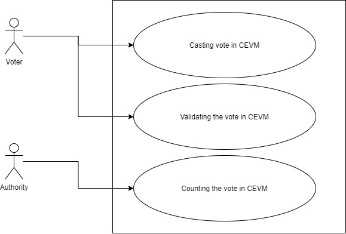
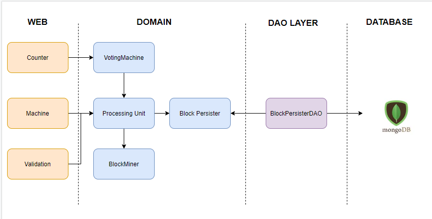
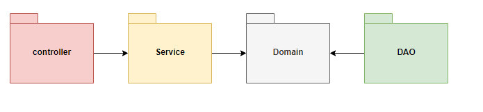

# Crypto-EVM
EVM based on cryptography

Any voting system should have the following characteristics.
1) **confidentiality:** System should be confidential about the voter and there choices.
2) **Validation:** Voter should be able to validate the choices they made.
3) **Integrity:** Their should not be any temporing with the data recoreded in the system.

Although the current voting system(EVM) takes care of the confidentiality but hardly do any thing for Validation and Integrity.
With the help of cryptography and blockachiain data structure, we can improve on the validation and integrity of the EVM's
The example presented here is an EVM based on the cryptography and  blockachiain data structure, to demonstrate the implementation of the confidentiality, validation and integrity characteristics of the EVM.

**Features of CEVM:**
1) CEVM stores the voting data in the blockchain format. Because of this, it is impossible to change the voting data stored in the system.
2) After making the choice by voter, system will return the metadata about the choice. This metadata can be used for validating the already casted vote.
3) System stores the data using cryptographic in the persistent layer. Once it is added in to the database, only valid authority can decrypt the stored data. The data and key can be made public for transparency after election process is completed.
4) Voter can validate his vote using the metadata and mark his vote as valid. System also gives the data about how many votes are validated.
5) Only authorized person can count the votes, by supplying the private key. 

# Use Case Scenario Overview: Crypto-EVM



**Use Case of CEVM:**
1) Voter should be able to vote for candidate of his/her choice. After vote recorded in CEVM, it should return the following metadata about the choice made by the voter </br>
     - Hash of the previous block.</br>
     - Identity of the machine where choice is recorded.</br>
     - Nonce value for calculating hash.</br>
     - Time when the vote is recorded;</br>
     - Current hash of the block;</br>
     - Block Number of the block generated;</br>
     - Block Code, four digit code used by the voter, to validate the block in future. This is a secrete code generated by the machine only for the voter.</br>
     - Block Valid,  value indicating if the current vote is valid.</br>
2) User should be able to validate the block, he/she made in the first use case. After voting is completed,  voter can check if his/her vote still exists in the machine and not being tampered. 
	Voter will send the following parameter to the voting machine.
		machineNumber  : Machine id  where vote is stored
                blockNumber : block number generated from the use case 1
		candidateVote : candidate id to which voter has voted in use case 1
		blockCode : valid block code generated in first use case 1
 	The machine will return the calculated hash of the data. So  if calculated hash is equal to printed hash then vote is correctly stored, else the blockchain is tampered.
3) After validating the block in the use case 2. User will mark the block as valid. System will change the property of the block isBlockValid =true
4) Voter can see the status of the validated votes for the machine. System will return the total validated votes and total votes for the machine.  
5) Only authorized entity can count the vote by supplying the private key for the machine. System will return the votes per candidate. System should also provide the vote count till certain blocks.

# Testing and Running the Application:
Following steps are to run the appliction.

1)  Install mongodb from the link https://docs.mongodb.com/manual/administration/install-community/ and start the database.
2) Run the java class [VotemachineApplication.java](src/main/java/com/piyush/blockchain/votemachine/VotemachineApplication.java) 

The spring boot application will start on the port 8080. We can execute the following scenarios.

```yaml
Scenario: Voter cast cast the vote for candidate 1
          http://localhost:8080/vote
Request:  {
              "candidateId":1,
              "machineId":1
          }   
                 
Response: {
              "previousHash": "",
              "machineNumber": "1",
              "nonce": 47,
              "timeStamp": "2020-07-08T23:07:16.585",
              "hash": "00005130679645122f139dab17c3f1e16691e1ac6ce1755949929a455c5caa80",
              "blockNumber": 1,
              "blockCode": 639,
              "blockValid": false
          }
Database: [Database View after completion](img/request1.png)           
```
```yaml
Scenario: Voter cast cast the vote for candidate 2
	      http://localhost:8080/vote
Request:  {
            "candidateId":2,
            "machineId":1
          }
Response: {
            "previousHash": "00005130679645122f139dab17c3f1e16691e1ac6ce1755949929a455c5caa80",
            "machineNumber": "1",
            "nonce": 29,
            "timeStamp": "2020-07-08T23:09:59.177",
            "hash": "00be53c76067ceae15703398c7cb5ffe61c917b4b6b6eab86b81ca385854ef3b",
            "blockCode": 229,
            "blockValid": false
          }
Database: [Database View after completion](img/request2.png)
```
```yaml
Scenario: Validate the block 2 with valid candidate id
          http://localhost:8080/vote/valid/block
Request:  {
           "blockNumber":2,
           "machineNumber":"1",
           "candidateVote":2,
           "blockCode":229
          }
Response: {
              "previousHash": "00005130679645122f139dab17c3f1e16691e1ac6ce1755949929a455c5caa80",
              "machineNumber": "1",
              "nonce": 29,
              "timeStamp": "2020-07-08T23:09:59.177",
              "hash": "00be53c76067ceae15703398c7cb5ffe61c917b4b6b6eab86b81ca385854ef3b",
              "blockNumber": 2,
              "blockCode": 229,
              "blockValid": false
          }  
```

```yaml
Scenario: Validate the block 2 with Invalid candidate id
          http://localhost:8080/vote/valid/block
Request:  {
           "blockNumber":2,
           "machineNumber":"1",
           "candidateVote":1,
           "blockCode":229
          }
Response: {
              "previousHash": "00005130679645122f139dab17c3f1e16691e1ac6ce1755949929a455c5caa80",
              "machineNumber": "1",
              "nonce": 25,
              "timeStamp": "2020-07-08T23:09:59.177",
              "hash": "009682278e671226683368efb054e22db279a55057881f50f30467becccfae8a",
              "blockNumber": 2,
              "blockCode": 229,
              "blockValid": false
          }  
```
```yaml
Scenario: Mark the block 2 as valid
          http://localhost:8080/vote/valid/block
Request:  {
           "blockNumber":"2",
           "machineNumber":"1",
           "blockCode":229 
          }
Response: Void
``` 

```yaml
Scenario: Check the valiation stats for the machine
          http://localhost:8080/vote/stats/1
Request: None
Response: {
              "totalVotes": 2,
              "validatedVotes": 1
          }
Database: [Database View after completion](img/request5.png)          
``` 

```yaml
Scenario: Count the votes from machine number 1
          http://localhost:8080/vote/count
Request:  {
         
              "machineNumber":"1",        
              "privateKey":"MIICdgIBADANBgkqhkiG9w0BAQEFAASCAmAwggJcAgEAAoGBALfFpliXF+MtRHakKgSLl0XZQMNViIKR6rmhCS7vF85/3xanwg8pxFqgfqX1wxG9fto3YuAsZE4HriqQJjyAYNAccC5YdYS8dAuBIX0O5VNz9Sz0pDxYPfoIsEA8uNm9aXFrezslQp3t5aE4wik/D14zYrHK4OeQZKZOmRu5fT89AgMBAAECgYBdhyAT8kHcAsvXPdGMoqaIi/sj7sIdAbpeYxDTbCfHltipJRPkt7MRFKGgQSXYP4Lx+EJAKRebhtkjHF35aLTcF7Rz3CnYR8pDaBMPdSM8/+WsGS9deC2zIn1lCNHcitH2YNReZA/jyNz19Cs5sVHxJAMwrU4uKsQUTD0nR+s+QQJBAPFKX5S1msymOmXvpr23oM7QUem9HGWY/5jYiU2E8rIeMWA93KVyEZYPM6Rg6P0aGRHD5hRu8vqamqGZLXJ/lwkCQQDC+aHgBwtnUZOAjOJtV1+TLcJKgQYSBvc2Omv93vU1FuVU8m8e29zZwiTPRUiSy+mM+qHk54tN4ryCykToPl+VAkEAxvRCN4Y+q7vsrxyZ6hi9OYo/4HEUNxmet1Lkc8zJqOCIagjYJHsX0RmbxVA7DGc2gJV84yBQrR5JnjGFbcGSsQJASCOEuRbiKUANiyqVPE9vlU0A7f/+9vyMywuimTO9Ff96qotogcpnVEp4xBemWmoH55lz/PWOnSqfBOVByYwKYQJAbVp8aIZrRnltyig62iygU0WLiqiFcMiC9UxAohc5y8vKVusj+UNQwkRa00TcmMTwy7I4jveLAtB0ms/MZLCjsQ=="
          
          }
Response: {
              "map": {
                  "1": 1,
                  "2": 1
              }
          }
``` 

```yaml
Scenario: Count the votes from machine number 1 till block 1
          http://localhost:8080/vote/count/1
Request:  {
         
              "machineNumber":"1",        
              "privateKey":"MIICdgIBADANBgkqhkiG9w0BAQEFAASCAmAwggJcAgEAAoGBALfFpliXF+MtRHakKgSLl0XZQMNViIKR6rmhCS7vF85/3xanwg8pxFqgfqX1wxG9fto3YuAsZE4HriqQJjyAYNAccC5YdYS8dAuBIX0O5VNz9Sz0pDxYPfoIsEA8uNm9aXFrezslQp3t5aE4wik/D14zYrHK4OeQZKZOmRu5fT89AgMBAAECgYBdhyAT8kHcAsvXPdGMoqaIi/sj7sIdAbpeYxDTbCfHltipJRPkt7MRFKGgQSXYP4Lx+EJAKRebhtkjHF35aLTcF7Rz3CnYR8pDaBMPdSM8/+WsGS9deC2zIn1lCNHcitH2YNReZA/jyNz19Cs5sVHxJAMwrU4uKsQUTD0nR+s+QQJBAPFKX5S1msymOmXvpr23oM7QUem9HGWY/5jYiU2E8rIeMWA93KVyEZYPM6Rg6P0aGRHD5hRu8vqamqGZLXJ/lwkCQQDC+aHgBwtnUZOAjOJtV1+TLcJKgQYSBvc2Omv93vU1FuVU8m8e29zZwiTPRUiSy+mM+qHk54tN4ryCykToPl+VAkEAxvRCN4Y+q7vsrxyZ6hi9OYo/4HEUNxmet1Lkc8zJqOCIagjYJHsX0RmbxVA7DGc2gJV84yBQrR5JnjGFbcGSsQJASCOEuRbiKUANiyqVPE9vlU0A7f/+9vyMywuimTO9Ff96qotogcpnVEp4xBemWmoH55lz/PWOnSqfBOVByYwKYQJAbVp8aIZrRnltyig62iygU0WLiqiFcMiC9UxAohc5y8vKVusj+UNQwkRa00TcmMTwy7I4jveLAtB0ms/MZLCjsQ=="
          
          }
Response: {
              "map": {
                  "1": 1
              }
          }
``` 
```yaml
Post man collection for the application: https://www.getpostman.com/collections/6bf622dfa9ec6fea193c

``` 
# Crypto-EVM: Architecture


# Crypto-EVM: Component/Package diagram


# Crypto-EVM: Tests


## Domain Tests:
1) [blockminer Test](src/test/java/com/piyush/blockchain/votemachine/domain/blockminer) 
2) [processingunit Test](src/test/java/com/piyush/blockchain/votemachine/domain/processingunit) 
3) [votingmahcine Test](src/test/java/com/piyush/blockchain/votemachine/domain/votingmahcine) 

## Service Tests:
1) [counter Test](src/test/java/com/piyush/blockchain/votemachine/service/counter) 
2) [validator Test](src/test/java/com/piyush/blockchain/votemachine/service/validator) 
3) [votingmachine Test](src/test/java/com/piyush/blockchain/votemachine/service/votingmachine) 

## DAO Tests:
1) [BlockPersisterDAOTest.java Test](src/test/java/com/piyush/blockchain/votemachine/dao/BlockPersisterDAOTest.java) 

## BDD/Controller Tests:
1)  [counter Test](src/test/java/com/piyush/blockchain/votemachine/controller/counter) 
1)  [machine Test](src/test/java/com/piyush/blockchain/votemachine/controller/machine) 
1)  [validation Test](src/test/java/com/piyush/blockchain/votemachine/controller/validation) 

# Improvments:
1) Add other comoponets such voter identifer, machine config (setup  candidate list, machine primary/public key).
2) Extend the the idea to online voting. Voting from phone.


