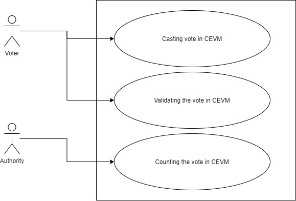

# Voting Machine
EVM based on cryptography

Any voting system should have the following characteristics.
1) **confidentiality:** System should be confidential about the voter and there choices.
2) **Validation:** Voter should be able to validate the choices they made.
3) **Integrity:** Once all the choces are made, their should not be any temporing of the data recoreded in the system.

Although the current voting system(EVM) take cares of the confidentiality but hardly any thing for Validation and Integrity.
With the help of cryptography and blockachiain data structure, we can improve on the validation and integrity of the EVM's
The example presented here is an CEVM , based on the cryptography and  blockachiain data structure to demonstrate the implementation of the confidentiality, validation and integrity

**Features of CEVM:**
1) CEVM stored the voting data in blockchain format. Because of this, it is impossible to change the voting data stored in the system.
2) Voter can cast the vote, after making the choice, system will return the metadata about the choice. This metadata can be use for validating the already cast vote.
3) System stores the data using cryptographic in the persistent layer. Once it is added in to the database, only valid authority can decry-pt. The data and key can be made public for transparency.
4)  Voter can validate his vote using the metadata and mark the his vote as valid. System also gives the data about how many votes are validated.
5) Only authorized person can count the votes, by supplying the private key. 

# Use Case Scenario Overview: Crypto-EVM

